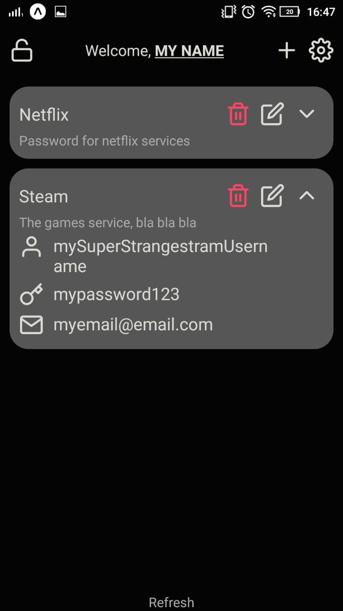
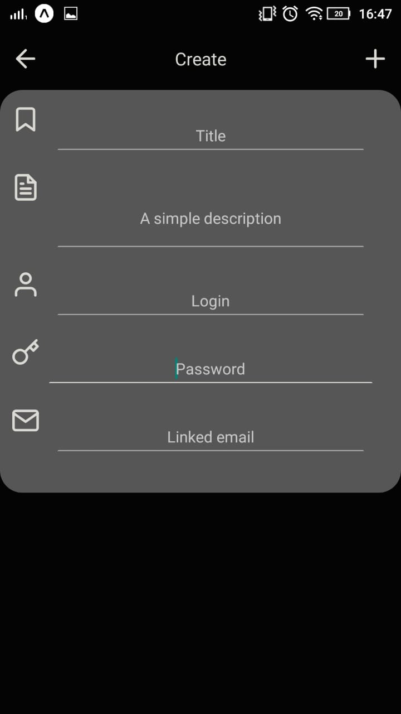

# Password Wizard

> One of my biggest problems when thinking about organizing stuff is: where can I storage my passwords? So I decided to create this aplication to help me save all acount passwords.


## Features:
* Store passwords in a simple way
* Use AsyncStorage to store passwords locally
* Works on English and in Portuguese

---

## Installation
Android:
* Download the APK in this [link](https://isitchristmas.com/) (I don´t have an appleID, so this is why It's only on android)

## Usage example
### See all your passwords in a simple UI


### Click on the + button and start saving your passwords


---

## Development setup
Run
```
yarn init
yarn start //this will star expo
```


## Release History
* 1.0.0
    * First working model (31/05/2020)

## Meta

Diego Lopes Ferreira – [@Twitter](https://twitter.com/Diego_simSouEu) – [@Instagram](https://www.instagram.com/diego.lopes.f/) - [LinkedIn](https://www.linkedin.com/in/diego-lopes-ferreira-a23a8919b/)

Distributed under the MIT license. See [this file](LICENSE) for more information.
